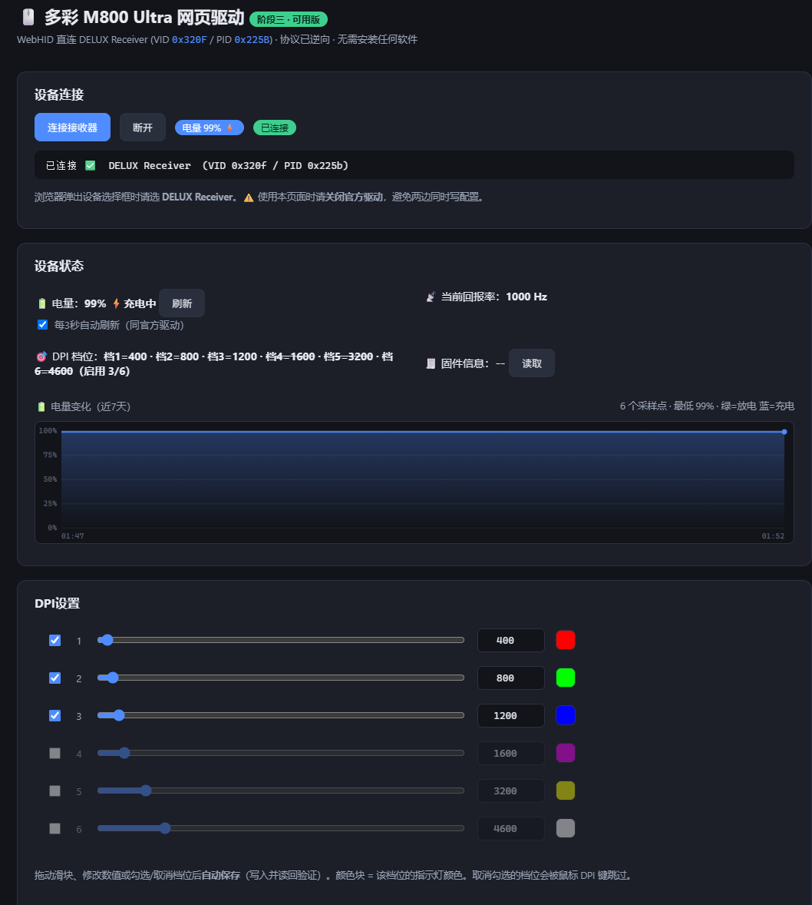

# M800 Ultra WebDriver 🖱️

**多彩 DELUX M800 Ultra 鼠标的开源网页驱动** —— 基于 WebHID，纯浏览器运行，
零安装、零后台进程、跨平台（Windows / macOS / Linux / ChromeOS）。

> 官方只提供 Windows 客户端，官方 [WebHub 在线驱动](https://webhub.delvexpress.cc)
> 也不支持 M800 Ultra。本项目通过逆向 2.4G 接收器（`VID 0x320F / PID 0x225B`
> "DELUX Receiver"）的 HID 配置协议，实现了完整的设置管理。

## 📸 界面预览



## ✨ 功能

| 功能 | 状态 |
|---|---|
| DPI 六档位读写（100–26000，滑块+数值，勾选启用/禁用档位） | ✅ 实机验证 |
| 指示灯颜色显示（每档位对应灯色） | ✅ |
| 回报率 125/250/500/1000 Hz | ✅ 实机验证 |
| 电量显示 + 充电状态检测（⚡） + 7 天历史曲线图（蓝=充电/绿=放电分段着色） | ✅ 实机验证 |
| 静默高度 LOD（1MM/2MM） | ✅ 实机验证 |
| 直线校准 / 移动同步 / 深度休眠开关 | ✅ 实机验证 |
| 休眠设置（3/4/5/10/15/20 分钟） | ✅ 实机验证 |
| 按键延时（2/4/6/8/10 ms） | ✅ 实机验证 |
| 无感知自动保存（改动 700ms 防抖写入 + 读回验证） | ✅ |
| 官方驱动改动实时同步（监听设备配置广播） | ✅ |
| 自动重连（授权过的设备打开页面即连） | ✅ |
| 协议命令台（自动 CRC，可收发任意命令，供折腾用） | ✅ |

## 🚀 快速开始

### 方式零：在线使用（GitHub Pages，推荐）🌐

直接访问 **<https://tc-zerol.github.io/M800-Ultra-WebDriver/>** —— 自带 HTTPS，
WebHID 开箱即用，无需安装任何东西、无需任何浏览器 flag。

> 本仓库已开启 GitHub Pages。如果你 fork 了本项目，给自己的仓库开启方法：
> **Settings → Pages → Build and deployment → Source 选 `Deploy from a branch`
> → Branch 选 `main` / `/ (root)` → Save**。等 1~2 分钟即可通过
> `https://<你的用户名>.github.io/<仓库名>/` 访问，之后每次 push 到 `main`
> 分支都会自动更新页面。

### 方式一：本地运行（最简单）

1. 安装 [Python](https://www.python.org/)（仅用于起静态服务器）
2. **关闭官方驱动**（避免两边同时写配置）
3. 双击 `start.bat`，浏览器自动打开 `http://127.0.0.1:8765`
4. 点击"连接接收器"，选择 **DELUX Receiver**

> 必须用桌面版 **Chrome / Edge**（WebHID 要求），且通过 `localhost` 或 HTTPS 访问。

### 方式二：Docker / 群晖 NAS 自托管

```bash
docker compose up -d    # 访问 http://<主机IP>:54777
```

⚠️ **WebHID 要求安全上下文**（HTTPS 或 localhost）。局域网 HTTP 访问时，
在 Chrome 打开 `chrome://flags/#unsafely-treat-insecure-origin-as-secure`，
填入 `http://<主机IP>:54777`，启用并重启浏览器即可（该 flag 只放行你填的地址，
不影响其他网站）。长期方案：反向代理 + Let's Encrypt 证书。

## 📖 协议文档

完整的逆向协议文档见 **[PROTOCOL.md](PROTOCOL.md)**：报告格式、CRC16-MODBUS、
命令集、四个配置块的字节级映射、DPI 9 字节跨块结构、"其他设置"全部字段。
想给其他型号或语言（如 Linux 工具）做适配的可以直接参考。

## 🛠️ 逆向工具（tools/）

| 文件 | 用途 |
|---|---|
| `hid_monitor.py` | HID 监听/发送工具（ctypes 实现，`--cmd "1a"` 查电量、`--cmd "05 18 00"` 读配置块） |
| `analyze.py` | 抓包日志分析 |
| `crack_crc.py` | CRC 算法爆破（用来确定 CRC16-MODBUS） |

逆向方法：改官方驱动设置 → 读配置块 → 与基线 diff → 定位字节 → 写回验证。

## 🔍 相关项目

- 检索时**未发现** M800 Ultra 的已有开源驱动（2026-09）。
- [OpenMouse](https://github.com/viasnake/OpenMouse) — 另一位作者对多彩鼠标驱动的
  开源逆向尝试（面向 M800 Pro DB，VID/PID 与协议不同，未覆盖 M800 Ultra）。
- 官方 [Delux WebHub](https://webhub.delvexpress.cc) 在线驱动仅支持 M900/M600 等新型号。

## ⚠️ 免责声明

使用本项目前请阅读 **[DISCLAIMER.md](DISCLAIMER.md)**。简而言之：本项目与多彩公司
无关，逆向仅为互操作与学习目的，**使用风险自负**；配置写乱可用官方驱动恢复默认。

## 📄 许可证

[MIT](LICENSE)

## 🙏 致谢

协议逆向与实机验证由项目作者与 Claude（AI 编程助手）协作完成。

